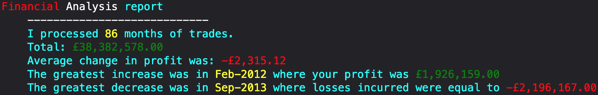

# Financial Analysis

[View the live page](https://drgunbot.github.io/Console-Finances/)  

**How it works:**  

This code analyzes a dataset of financial records in this format and calculates various summary statistics:

| Date / year period  | Amount displayed as an integer |
| ------------- |:----------:|
| Jan-2000      | 8742387    |
| Feb-2000      | -1721637   |
| March-2000    | 3123243    |

The dataset consists of arrays with two fields, a date and a profit or loss amount. The code will calculate the following:

* The total number of months included in the dataset
* The net total amount of profit or loss over the entire period
* The average of the changes in profit or loss over the entire period
* The greatest increase in profit (date and amount) over the entire period
* The greatest decrease in loss (date and amount) over the entire period

## How the code works:

1. The finances variable is defined and initialized to an array of financial records.

2. Several variables are initialized to store the total number of months, total profit, average change in profit, and the greatest increase and decrease in profit.

3. A loop iterates over the financial records. For each record:
    1. The date and profit are extracted from the record.
    2. The total number of months is incremented.
    3. The total profit is updated by adding the profit for the current record.
    4.If the current record is not the first record, the change in profit from the previous month is calculated. The average change in profit is updated by adding this change. If the change is the greatest increase or decrease in profit so far, the greatest increase and decrease variables are updated accordingly.
    
4. After the loop completes, the average change in profit is calculated by dividing the total change by the number of months minus one (since there is no change in the first month).

5. The results are formatted as strings with appropriate currency formatting
(**see notes**)
6. The results are output to the console.

## Output
The code will output the analysis to the console in the following format:  
  

## Notes:
I *slightly* deviated from the project twice because I found it interesting.

**These were my amendments:**

1) For starters, I was a bit uncomfortable with how the negative values were displayed in the console output. For example: 
  `£-500` (how the bootcamp readme specified) is incorrect, but `-£500` is correct.  
  I solved this by formatting the variables `totalProfit`, `averageChange`, `greatestIncrease[1]`, and `greatestDecrease[1]` as currency using the `toLocaleString()` method. 
  The `toLocaleString()` method converts a number to a string, using a local language format to display the number with the appropriate thousands separators and currency symbol.

    I passed two arguments to the toLocaleString() method:
    1. `en-gb`: Which specified that the local language format to use is British English... you know... because I'm Bri'ish innit  

    2. `{style: 'currency', currency: 'GBP'}`: specified that the number should be formatted as currency, and the currency symbol to use is the British pound (GBP).  

    After the `toLocaleString()` method was called on each of the variables, the resulting strings are stored in the variables `totalProfitFormatted`, `averageChangeFormatted`, `greatestIncreaseFormatted`, and `greatestDecreaseFormatted`. These variables now contain strings that represent the numbers in the appropriate local language format, with the appropriate currency symbol.  

    
      
    
2) The original code simply output the results to the console using plain text.

    In the revised code, I used a JavaScript template literal to output the results to the console with formatting. I also used the `console.log()` function and passed in a template literal as the argument.  
    The template literal contains placeholders for the values you want to output, along with formatting instructions using the `%c` placeholder. 
 
    The `%c` placeholder is a special placeholder that tells the `console.log()` function to output the following text in the specified color.   
    For example, `'color: cyan'` specifies that the text should be output in cyan, and `'color: yellow'` specifies that the text should be output in yellow etc.  
    I chose to use this formatting to make the output more visually appealing and easier to read. The different colors help to distinguish between different types of information, such as months and profits.  
 
    Finally, I used ternary operators `(? :)` instead of an if else statement to specify different colors for positive and negative values. For example, if the value is positive, it is output in green, and if the value is negative, it is output in red. This helps to quickly identify whether the value is positive or negative at a glance.

    Overall, I think the revised code provides a more visually appealing and easier to read output of the financial analysis results, compared to the original code which simply output the results as plain text in multiple logs.  
    
    (I also included the expected code commented out at the bottom of the `index.js` file, in case I had deviated too much and wouldn't be graded. I also tried playing with a table to try different methods to output, but I didn't spend much time on it. It works, but it isn't pretty)